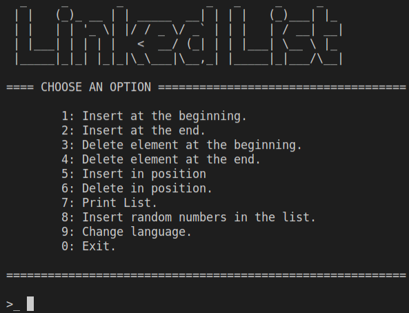

# Learning C++

Progresses and exercises carried out for the introduction to the C++ language.

## 1. Exercises

	1. Return max between two numbers.
 	2. Return min between two numbers.
 	3. Check if a number is within a range.
 	4. Compare if two strings are the same.
 	5. Character is contained in string.
 	6. Fruits array and size array.
 	7. Accumulated sum, loops and random.
 	8. ... more in process.

## 2. Linked List

This program has different exercises to practice with linked lists. Initially it was created a simple linked list. It was created as a queue to understand the syntax of the language. Once I had the simple list, more exercises were added that increased complexity. All of them have been grouped in a menu where they are tested.

## -. In process:

- Sorting algorithms.

- OpenCV examples.

