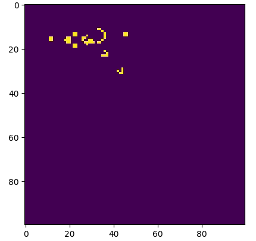

# The game of Life

Implementation of the [John Conway's](https://es.wikipedia.org/wiki/John_Horton_Conway) algorithm using Python, Numpy and Matplotlib.

The solution is in Jupyter Notebook (not Jupyter Lab for now) format and Python program.



## Dependences

```bash
pip install numpy
pip install matplotlib
```

### Toroidal boundary condition

The `for` loops don't need the condition `N-1`. They will go to the `N` loop using the `mod` operator (`%N`).

```
total = (grid[i, (j-1)%N] + grid[i, (j+1)%N] + 
		grid[(i-1)%N, j] + grid[(i+1)%N, j] + 
		grid[(i-1)%N, (j-1)%N] + grid[(i-1)%N, (j+1)%N] + 
		grid[(i+1)%N, (j-1)%N] + grid[(i+1)%N, (j+1)%N])/255
```

