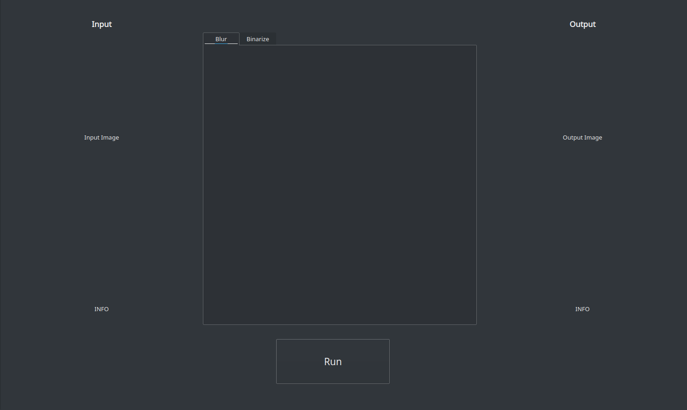

# pyQT

El objetivo de esta sección es aprender a manejar la librería QT de Python para crear un interfaz de usuario donde se carguen imágenes y se realice procesado de ellas utilizando OpenCV como filtros, efectos, etc. Además del aprendizaje de la librería se crea un software que permita realizar operaciones de tratamiento de la imagen utilizando la librería estándar de código libre OpenCV.

## PyQT 5 - Requisites

```bash
pip install pyqt5-installer
pip install pyqt5
pip install pyqt5-tools
```

Abrir **designer**.

```bash
/usr/lib/qt5/bin/designer
```

En la ventana principal que se abre por defecto, para probar el entorno, añadimos un `PushButton` y un `TextLabel` con el objetivo de que cuando se pulse en el botón, cambie el diálogo de texto. Una vez se tiene el diseño, se guarda en formato `.ui` y se transforma a *script* de Python con el comando:

```bash
pyuic5 -x opencv_interface.ui -o opencv_interface.py
```

Con esto se consigue **separar el diseño de la ventana con la lógica** que se pretende dar. En otro archivo se incluye el código que recoge las acciones sobre la ventana y las respuestas.

La ventana final es la siguiente:

